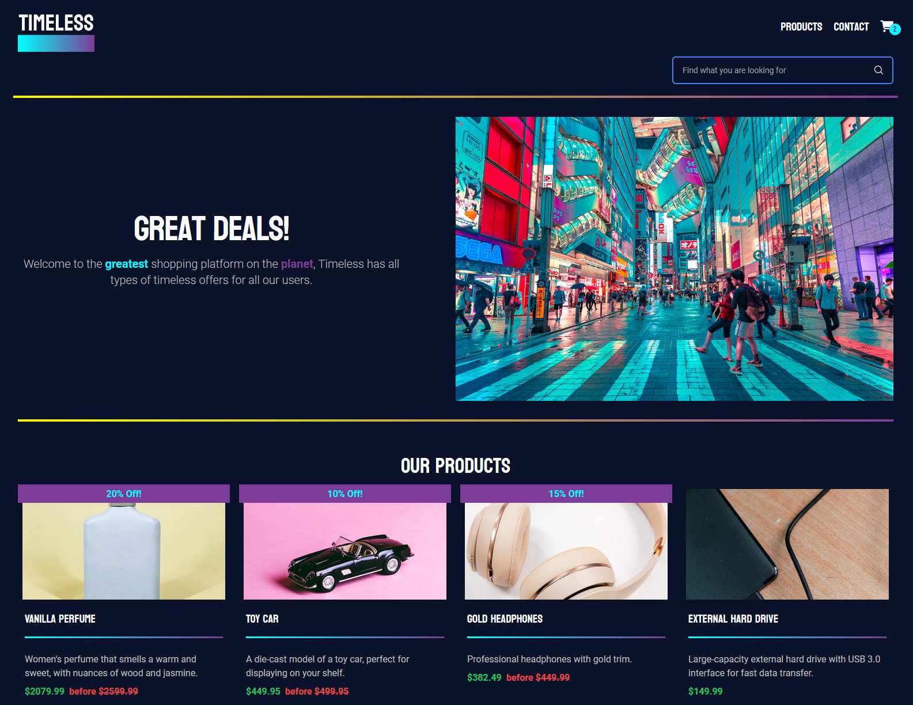

# React E-Commerce Store TimeLess




## Overview

This project is a fully functional e-commerce store built with React. It interacts with the [Noroff Online Shop API](https://v2.api.noroff.dev/online-shop) to display products, handle cart functionality, and process orders. The application is designed to be responsive and user-friendly, providing a seamless shopping experience.

## Features

### Pages

1. **Homepage**

   - Displays a list of all products fetched from the API.
   - Includes a look-ahead search bar for filtering products by name.
   - Clicking on a product redirects the user to the individual product page.

2. **Individual Product Page**

   - Displays detailed information about a single product, including title, description, image, and reviews (if available).
   - Shows the discounted price and calculates the discount percentage if applicable.
   - Includes an "Add to Cart" button to add the product to the cart.

3. **Cart Page**

   - Lists all items in the cart.
   - Displays the total price of the cart.
   - Includes a "Checkout" button to proceed to the checkout process.

4. **Checkout Success Page**

   - Displays a confirmation message upon successful order placement.
   - Provides a link to return to the store.
   - Clears the cart when the order is completed.

5. **Contact Page**
   - Contains a contact form with the following fields:
     - Full name (minimum 3 characters, required).
     - Subject (minimum 3 characters, required).
     - Email (must be valid, required).
     - Body (minimum 3 characters, required).
   - Validates form input and logs the data to the console upon successful submission.

### Components

- **Header**

  - Includes a navigation bar.
  - Contains a Cart Icon component that displays the current number of items in the cart.

- **Footer**

  - Provides footer content for the application.

- **Layout**
  - Wraps pages with the Header and Footer for consistent layout.

### Additional Functionality

- **Search Bar**

  - Filters products on the homepage based on user input.
  - Redirects users to the product page when clicking on a filtered product.

- **Dynamic Routing**

  - Uses React Router to navigate between pages.
  - Implements dynamic segments for individual product pages using product IDs.

- **Cart State Management**

  - Tracks items added to the cart.
  - Updates the cart overlay in the header.

- **Checkout Flow**

  - Displays cart items and total on the Checkout page.
  - Clears the cart upon successful checkout.

- **Responsive Design**
  - Ensures the application is accessible and visually appealing on all devices.

## Getting Started

### Prerequisites

- Node.js
- npm or yarn

### Installation

1. Clone the repository:
   ```bash
   git clone https://github.com/Barvand/JavaScript-Frameworks/
   ```
2. Navigate to the project directory:
   ```bash
   cd <Your folder>
   ```
3. Install dependencies:
   ```bash
   npm install
   # or
   yarn install
   ```

### Running the Application

1. Start the development server:
   ```bash
   npm start
   # or
   yarn start
   ```
2. Open the application in your browser at `http://localhost:3000`.

## Validation Rules

- **Full Name**: Minimum 3 characters, required.
- **Subject**: Minimum 3 characters, required.
- **Email**: Valid email format, required.
- **Body**: Minimum 3 characters, required.

